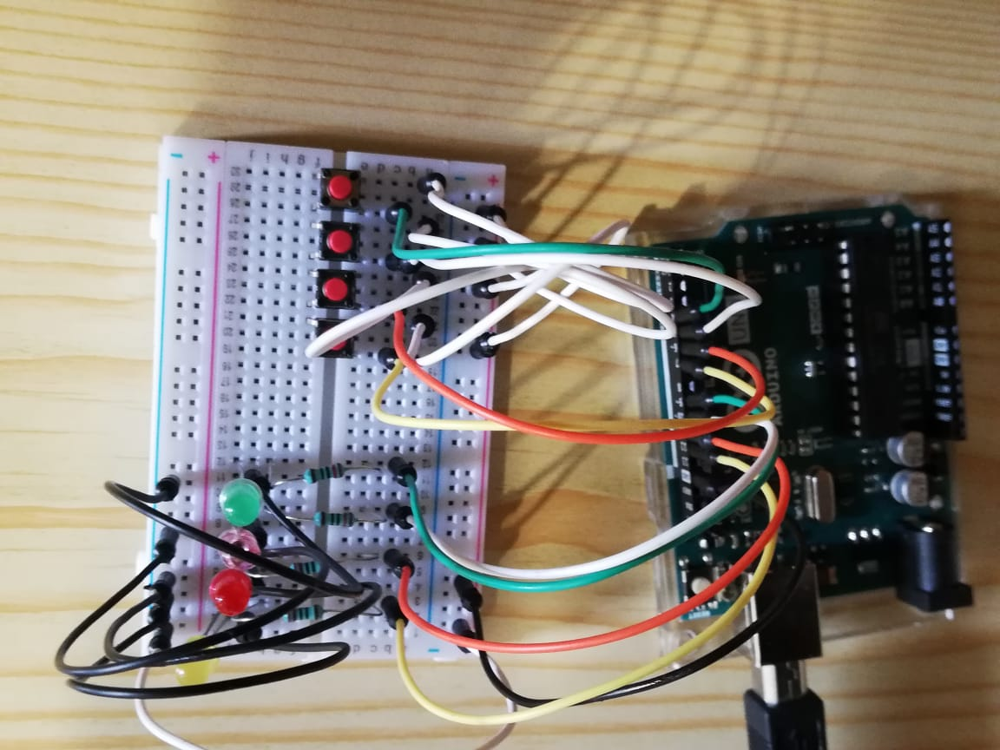

# Hit-the-mole

Introduction of Game: - This is a simple arcade game in which you Hit the Moles. Moles keep on coming and you have to kill them with your hammer. After hitting every new mole, the speed of their arrival increases. And at the moment you miss the mole you lose.

Description of this project: - This project is based on the principle that you have to hit the mole and after every correct hit the speed of arrival of mole increases i.e. wait time of next mole start decreasing after every correct hit and if you miss the mole your game is over.

Set up Instructions:
1.	Connect the Arduino board using the USB port to the PC.
2.	Open the Arduino console from PC and start coding.
3.	Select "Port" from TOOL-->Port, select "Board" from TOOL --> Boards
4.	Open the serial monitor (Ctrl+Shift+M) to monitor your outputs.
5.	Upload your coding, if green light start blinking in Arduino its mean you are connected. Project start working as per your code if it is not, make sure that your wire should be tightly connected.

Components:
1.	Arduino Uno
2.	4 x color (red, green, yellow, pink) illuminated momentary push button switch (or red, green, yellow, pink and 4 x Push buttons)
3.	4 x 220-ohm resistor
4.	holder or usb cable connect with computer
5.	Wires
Tools Used: soldering iron, cutter, screw drivers, saw, drill, glue gun (optional)

